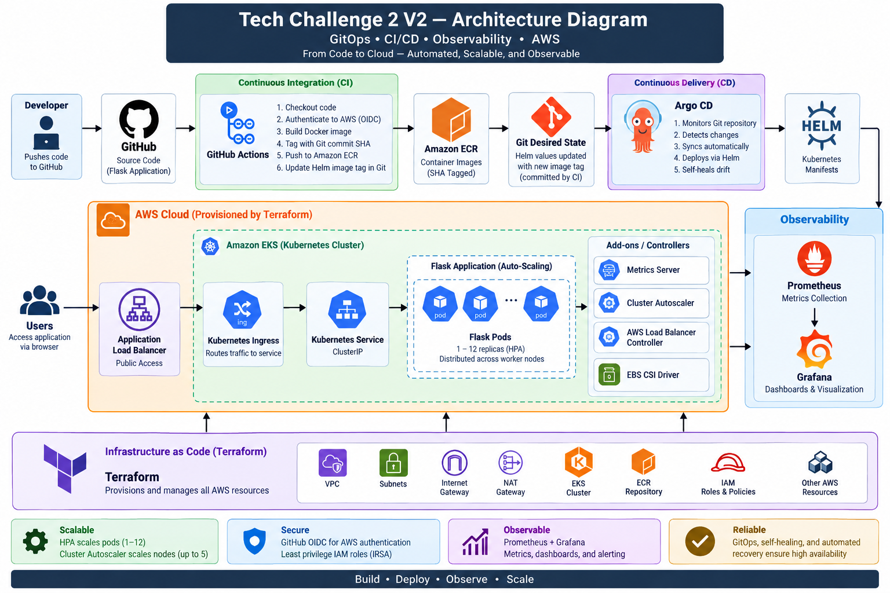
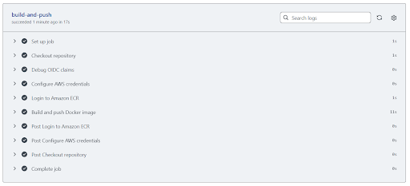
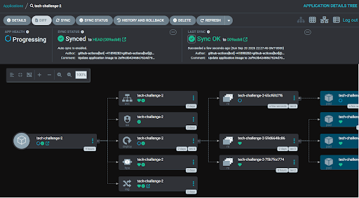
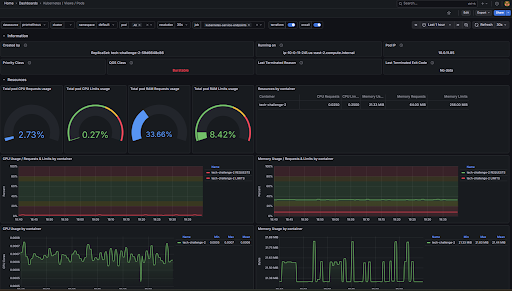
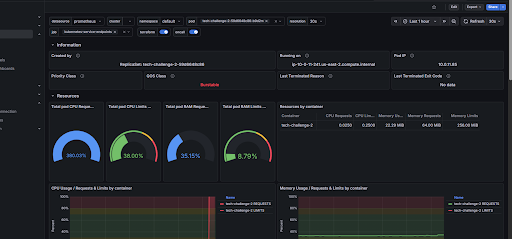
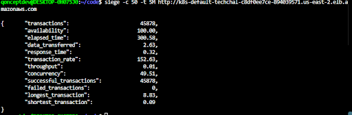

# Tech Challenge 2 V2 — GitOps, CI/CD & Observability

## Project Overview

Tech Challenge 2 V2 is an evolution of my original AWS EKS DevOps project.

V1 used Jenkins to build, push, and deploy a containerized Flask application to Amazon EKS. V2 modernizes the architecture by introducing GitHub Actions for Continuous Integration, Argo CD for Continuous Delivery, GitOps for Kubernetes deployment management, and Prometheus/Grafana for observability.

The project demonstrates a production-style workflow combining Infrastructure as Code, containers, Kubernetes, CI/CD, GitOps, autoscaling, monitoring, and AWS cloud infrastructure.

---

## Architecture



### V1

```text
GitHub
   ↓
Jenkins
   ↓
Docker
   ↓
Amazon ECR
   ↓
Helm / kubectl
   ↓
Amazon EKS
   ↓
Application Load Balancer
   ↓
Flask Application
```

### V2

```text
Developer
   ↓
GitHub
   ↓
GitHub Actions
   ↓
Docker Build
   ↓
Amazon ECR
   ↓
Git Desired State
   ↓
Argo CD
   ↓
Helm / Kubernetes
   ↓
Amazon EKS
   ↓
Application Load Balancer
   ↓
Flask Application
```

### Observability

```text
Amazon EKS / Kubernetes
          ↓
      Prometheus
          ↓
        Grafana
```

Terraform provisions and manages the underlying AWS infrastructure.

---

## V1 to V2 Evolution

| Area | V1 | V2 |
|---|---|---|
| CI | Jenkins | GitHub Actions |
| CD | Jenkins + Helm | Argo CD |
| Deployment Model | Pipeline-driven | GitOps |
| Image Versioning | Jenkins Build Number | Git Commit SHA |
| AWS Authentication | Jenkins EC2 IAM Role | GitHub OIDC + IAM |
| Monitoring | Kubernetes Metrics | Prometheus + Grafana |
| Infrastructure | Terraform | Terraform |

The main architectural change in V2 is separating CI from CD. GitHub Actions builds and publishes application images, while Argo CD continuously reconciles Kubernetes with the desired state stored in Git.

---

## Technology Stack

- **AWS** — EKS, ECR, VPC, IAM, ALB, EBS
- **Terraform** — Infrastructure as Code
- **Docker** — Application containerization
- **Kubernetes** — Container orchestration
- **Helm** — Kubernetes application packaging
- **GitHub Actions** — Continuous Integration
- **Argo CD** — Continuous Delivery
- **GitOps** — Desired-state deployment management
- **Prometheus** — Metrics collection
- **Grafana** — Monitoring dashboards
- **Metrics Server** — HPA metrics
- **Siege** — Load testing
- **Python / Flask** — Application

---

## Infrastructure as Code

Terraform provisions the AWS infrastructure, including:

- Custom VPC
- Public and private subnets
- Internet and NAT gateways
- Amazon ECR repository
- Amazon EKS cluster
- Managed EKS node group
- IAM roles and policies
- GitHub Actions OIDC/IAM integration
- AWS Load Balancer Controller IAM
- Cluster Autoscaler IAM
- EBS CSI Driver IAM

EKS worker nodes run in private subnets while the Application Load Balancer provides public access to the Flask application.

---

## Kubernetes & Helm

The Flask application is deployed to Amazon EKS using Kubernetes and Helm.

The deployment includes:

- Kubernetes Deployment
- ClusterIP Service
- ALB Ingress
- Readiness and liveness probes
- CPU and memory requests/limits
- Horizontal Pod Autoscaler
- Topology spread constraints

Application traffic follows:

```text
Internet
   ↓
AWS Application Load Balancer
   ↓
Kubernetes Ingress
   ↓
ClusterIP Service
   ↓
Flask Pods
```

---

## GitHub Actions CI

GitHub Actions automatically triggers when application code changes.

The CI workflow:

1. Checks out the repository.
2. Authenticates to AWS using OIDC.
3. Builds the Flask Docker image.
4. Tags the image using the Git commit SHA.
5. Pushes the image to Amazon ECR.
6. Updates the Helm image tag in Git.
7. Commits the new desired state.

Using Git commit SHAs provides traceability between application source code, ECR images, Git desired state, and the version running in EKS.

### CI Pipeline Validation



The successful workflow validates the automated path from application code through Docker build, Amazon ECR, and the GitOps desired-state update.

---

## GitHub OIDC & AWS IAM

GitHub Actions authenticates to AWS using OpenID Connect (OIDC) instead of storing long-lived AWS access keys in GitHub.

A dedicated IAM role allows the CI workflow to authenticate to AWS and push application images to Amazon ECR.

This keeps CI permissions separate from Kubernetes deployment responsibilities. GitHub Actions handles the build and registry workflow, while Argo CD owns deployment to EKS.

---

## GitOps & Argo CD

Argo CD manages Continuous Delivery using GitOps.

Git is treated as the source of truth for the Kubernetes application's desired state.

```text
Git Desired State
       ↓
    Argo CD
       ↓
     Helm
       ↓
 Kubernetes / EKS
```

Argo CD was configured with:

- Automatic synchronization
- Self-healing
- Helm-based deployments
- Continuous Git reconciliation

Both Git-based application updates and deliberate Kubernetes drift were tested to validate synchronization and self-healing.

### Argo CD Deployment Validation



The final application deployment reached **Healthy** and **Synced** status after Argo CD deployed the SHA-versioned application image to EKS.

---

## Monitoring & Observability

Prometheus and Grafana provide observability for the EKS environment.

Prometheus collects Kubernetes, node, and workload metrics. Grafana provides dashboards for visualizing cluster behavior before, during, and after load testing.

### Grafana — Before Load Testing



### Grafana — After Load Testing



These dashboards provide visual evidence of how Kubernetes resources responded as application demand changed.

---

## Persistent Storage

Persistent storage for monitoring workloads is provided through the AWS EBS CSI Driver.

The implementation uses Kubernetes PersistentVolumes and PersistentVolumeClaims backed by Amazon EBS, allowing monitoring data to persist independently of individual pods.

The EBS CSI Driver uses IAM Roles for Service Accounts (IRSA) to securely interact with AWS storage services.

---

## Autoscaling

The environment uses two independent levels of autoscaling.

### Horizontal Pod Autoscaler

HPA controls the number of Flask application pods based on workload demand.

- Minimum replicas: `1`
- Maximum replicas: `12`
- CPU target: `50%`
- Memory target: `50%`

### Cluster Autoscaler

Cluster Autoscaler manages worker-node capacity when Kubernetes cannot schedule additional pods.

The EKS node group uses `t3.small` instances and supports up to `5` worker nodes.

```text
Application Load Increases
        ↓
HPA Creates More Flask Pods
        ↓
Kubernetes Scheduler Places Pods
        ↓
Additional Capacity Required
        ↓
Cluster Autoscaler Adds Worker Nodes
```

HPA scales the application workload, while Cluster Autoscaler scales the infrastructure required to run that workload.

---

## Load Testing

Siege was used to generate sustained traffic against the Flask application through the public Application Load Balancer.

### Final Load Test

- **Concurrent users:** 50
- **Duration:** 5 minutes
- **Successful transactions:** 45,878
- **Failed transactions:** 0
- **Availability:** 100%
- **Transaction rate:** 152.63 transactions/second

During the test:

- HPA scaled the Flask application from `1` to `12` pods.
- Cluster Autoscaler increased EKS worker capacity.
- Kubernetes distributed application replicas across available worker nodes.
- The environment automatically began scaling down after demand decreased.

### Siege Results



The test demonstrated that the application remained available while Kubernetes dynamically adjusted application and infrastructure capacity.

---

## End-to-End CI/CD Validation

The complete V2 workflow was validated by making a visible change to the Flask application and pushing the change to GitHub.

```text
Code Push
   ↓
GitHub Actions
   ↓
Docker Build
   ↓
SHA-Tagged Image
   ↓
Amazon ECR
   ↓
Git Desired State Updated
   ↓
Argo CD Auto-Sync
   ↓
Amazon EKS
   ↓
Application Load Balancer
   ↓
Updated Flask Application
```

The final deployment successfully:

- Triggered GitHub Actions from an application code change.
- Built and pushed a SHA-tagged Docker image to ECR.
- Updated the Helm desired state in Git.
- Triggered Argo CD Auto-Sync.
- Deployed the new image to EKS.
- Reached Healthy and Synced status.
- Served the updated Flask application through the public ALB.

---

## Troubleshooting Highlights

### GitHub Actions OIDC Authentication

**Problem:** GitHub Actions could not assume its AWS IAM role.

**Root Cause:** The repository identity contained in the GitHub OIDC token did not match the identity configured in the IAM trust policy.

**Resolution:** Inspected the actual OIDC claims and updated the Terraform-managed IAM trust relationship.

**Lesson:** OIDC authentication depends on an exact trust relationship between the external identity and AWS IAM.

### Cluster Autoscaler IRSA

**Problem:** Cluster Autoscaler could not interact with the AWS Auto Scaling Group.

**Root Cause:** The Kubernetes ServiceAccount did not match the identity configured in the IAM trust relationship.

**Resolution:** Aligned the ServiceAccount and IRSA configuration.

**Lesson:** Kubernetes ServiceAccount identity and AWS IAM trust configuration must match for IRSA authentication.

### Prometheus Persistent Storage

**Problem:** Prometheus remained Pending when requesting persistent storage.

**Root Cause:** The EKS cluster did not yet have the required EBS CSI storage integration.

**Resolution:** Added the AWS EBS CSI Driver, IAM role, and persistent storage configuration.

**Lesson:** Stateful Kubernetes workloads require both Kubernetes storage configuration and the underlying cloud storage integration.

### GitOps Deployment Scheduling

**Problem:** A new SHA-versioned Flask pod remained Pending during an Argo CD rolling deployment.

**Root Cause:**

- Two nodes had reached their pod capacity.
- Other nodes were restricted by topology spread constraints.
- Cluster Autoscaler had reached the configured four-node maximum.

**Resolution:** Increased the EKS node-group maximum to five. Cluster Autoscaler added the required capacity and Kubernetes successfully completed the rolling deployment.

**Lesson:** HPA replica limits, worker-node pod capacity, scheduling constraints, and Cluster Autoscaler limits are independent controls that must work together.

---

## Repository Structure

```text
devops-tech-challenge-2-v2/
├── .github/
│   └── workflows/
├── app/
│   ├── app.py
│   ├── Dockerfile
│   └── requirements.txt
├── helm/
│   └── tech-challenge-2/
├── images/
│   ├── tech-challenge-2-v2-architecture.png
│   ├── github-actions-success.png
│   ├── argocd-healthy-synced.png
│   ├── grafana-kubernetes-dashboard-before.png
│   ├── grafana-kubernetes-dashboard-after.png
│   └── siege-load-test-results.png
├── kubernetes/
├── terraform/
├── Jenkinsfile
├── .gitignore
└── README.md
```

The `Jenkinsfile` is retained as a reference to the original V1 implementation and demonstrates the project's evolution from Jenkins-based CI/CD to GitHub Actions and Argo CD.

---

## Key Results

The completed V2 project demonstrated:

- Terraform-managed AWS infrastructure
- Containerized Flask application
- Amazon EKS orchestration
- Helm-based Kubernetes deployments
- GitHub Actions Continuous Integration
- AWS authentication using GitHub OIDC
- Git SHA-based Docker image versioning
- GitOps-based Continuous Delivery
- Argo CD Auto-Sync and Self-Healing
- Kubernetes HPA
- EKS Cluster Autoscaler
- Prometheus metrics collection
- Grafana dashboards
- EBS-backed persistent storage
- ALB-based public application access
- 45,878 successful load-test transactions
- 0 failed load-test transactions
- 100% availability during the final Siege test
- Successful end-to-end automated deployment

---

## Project Outcome

Tech Challenge 2 V2 demonstrates the evolution of a traditional Jenkins-based CI/CD pipeline into a GitOps-based cloud deployment architecture.

The final environment integrates Terraform, AWS, Docker, Kubernetes, Helm, GitHub Actions, Argo CD, Prometheus, Grafana, autoscaling, persistent storage, and load testing into a single end-to-end DevOps platform.

The project provided hands-on experience designing, automating, monitoring, scaling, and troubleshooting a Kubernetes application running on AWS.